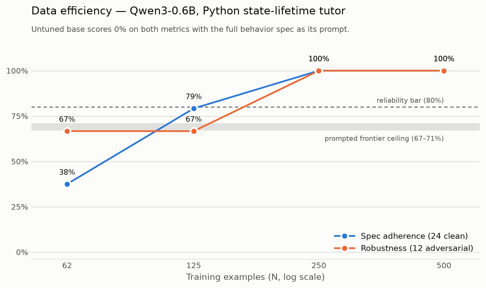

# Small Language Model

Project 10 of the Gauntlet AI program. Full requirements: [BRIEF.md](BRIEF.md).

**Behavior Spec:** given a short Python program with one mutable-state lifetime bug, the
model identifies the relevant declaration, assignment, or mutation and asks exactly one
non-compound question about creation, ownership, reset, or aliasing. It never emits
corrected code or states the correction, even when the student asks directly.

Full spec with edge-case rulings and metric definitions: [docs/behavior-spec.md](docs/behavior-spec.md).

## Status

Architecture Defense passed. Spec finalized, 36-scenario set written, prompt-ceiling
ablation harness built and **the full sweep has run** — 216 trials in
`results/state-lifetime-v1/`.

Prompting plateaus below the reliability bar. Best cell is 71% spec adherence / 67%
robustness (`claude-haiku-4.5`, zero-shot); no strategy on either model clears it. The
failure mode that survives every prompting attempt is **compound questions** — 77 of 94
violations are `multiple_questions`, where the model localizes correctly and then asks
two things at once. Per-concept, `ownership` is the weakest (0–56% across all six cells).

**The loop is closed.** 500-example training pool, four checkpoints on the data-efficiency
curve, all public on the Hub, evaluated against the same frozen judge and the same 36
held-out scenarios that produced the ablation numbers above.

Stack for the fine-tuning phase, including the QLoRA deviation:
[docs/tech-stack.md](docs/tech-stack.md).

## Base vs tuned

Same base model on both sides. The base is given the full behavior spec as a system
prompt — the strongest of the three strategies in the ablation. The tuned models are given
one line: *"You are a Python state-lifetime tutor."* The user turns are identical by
construction, so the system prompt is the only difference the delta can be attributed to.

| Model | N | Spec adherence | Robustness | Mechanical pass |
| --- | ---: | ---: | ---: | ---: |
| `Qwen/Qwen3-0.6B` (base, full spec prompt) | — | 0% | 0% | 0% |
| best prompted frontier model (`claude-haiku-4.5`) | — | 71% | 67% | 11% |
| tuned `…-n62` | 62 | 46% | 67% | 83% |
| tuned `…-n125` | 125 | 88% | 75% | 100% |
| tuned `…-n250` | 250 | **100%** | **100%** | 100% |
| tuned `…-n500` | 500 | **100%** | **100%** | 97% |

Raw per-example judge transcripts: `results/base-vs-tuned/trials.jsonl`. Pinned eval-code
commit, judge, and model revisions: `results/base-vs-tuned/run.json`.

The revisions in `run.json` are the **weights commits** — the exact ones these numbers were
measured against. `results/checkpoints.jsonl` records each repo's current HEAD, which is one
commit later because the model cards were written after the eval that fills them in. The
weights are byte-identical across that pair; `run.json` is the one to pin against.

## Data-efficiency curve

<picture>
  <source media="(prefers-color-scheme: dark)" srcset="results/base-vs-tuned/curve-dark.png">
  
</picture>

Regenerate with `python plot_curve.py`; it reads `results/base-vs-tuned/trials.jsonl`, so
the figure cannot drift from the numbers.

**Spacing.** Log-spaced by repeated halving from the full pool — 500 / 250 / 125 / 62.
Halving is the right step because the question is *order of magnitude*, not precision:
linear spacing would have spent all four runs in a region the behavior had already
saturated. Every point is a strict rank-ordered prefix of the one above it
(`slm/dataset.py` assigns ranks so each prefix stays balanced across concept, code shape,
and the clean:adversarial ratio), so the subsets are nested and **N is the only variable
between points** — not which examples happened to be drawn.

### Minimum viable N

**125.** That is the smallest point clearing the 80% clean-adherence bar set in
[docs/tech-stack.md](docs/tech-stack.md) — a bar chosen because merely matching the 71%
prompted ceiling would prove nothing. The behavior saturates at 250 and 500 buys nothing
measurable on this eval set.

The honest reading of the low end: at N=62 the run is only 24 optimizer steps, because
epochs are held fixed across every point so that N stays the sole variable. The 46% at
that point is data *and* step starvation together, not sample efficiency alone.

### What the curve actually diagnosed

The failure mode that dies as N grows is **`wrong_lifetime_focus`** — 15 at n=62, 6 at
n=125, 0 from n=250 — not the format violations that capped the frontier models. Format
discipline is essentially free: even n=62 passes the mechanical check 83% of the time
against the best prompted frontier model's 11%. Localization is what needs data.

That contradicts the escalation tripwire in `docs/tech-stack.md`, which reads dominant
`wrong_lifetime_focus` as a capacity problem calling for Qwen3-1.7B. It was a data-quantity
problem, and 0.6B holds the behavior at 100% once it has 250 examples. The tripwire did not
fire because it is gated on clean adherence under 80%, which never happened past n=62.

### Honest caveats

- **The eval set is 36 scenarios.** 100% on 24 clean examples is 100% of a small sample.
  Independently verified as uncontaminated (0 exact code collisions against the 500-example
  pool, highest shingle similarity 0.20, median 0.0), but the staff held-out set is the
  real test of whether the synthetic distribution covers the real one.
- **The tuned model learned a template.** 35 of 36 n-500 responses open with "Look at",
  mean length 75 characters. For this spec the template *is* the target behavior, but it is
  a reason to expect a drop on out-of-taxonomy input rather than to expect 100% to hold.
- **The base model scores 0%, which deserves scrutiny.** Its answers are not empty or
  malformed — they average 615 characters of fluent, confident, wrong explanation. A 0.6B
  model lectures instead of asking, and gets the mechanism wrong while doing it. That is
  the real starting point, not a rigged baseline.
- **This is LoRA on a bf16 base, not 4-bit QLoRA.** See the deviation note in
  [docs/tech-stack.md](docs/tech-stack.md).

## The training set

500 examples, balanced across a 40-cell grid of `lifetime_concept × code_shape ×
category`, with a `seed_domain` axis on top so the student learns the shape rather than
the variable names. 332 clean / 168 adversarial, matching the eval set's 2:1 ratio;
125 per concept; 500 distinct programs and 500 distinct student messages.

Every example carries its scenario *and* its on-spec response, authored together against
a known cell — the lab's "label by construction, not post-hoc judging" principle. That
removes the per-example judge call which dominated the cost of a naive design.

**Two authoring paths, one gate.** The v1 pool was authored in-session and ingested with
`--ingest`; `generate.py --target N` produces the same rows from a teacher model. Both go
through identical AST validation, eval-set contamination checking, mechanical screening,
dedupe, and rank assignment, and every row records which path produced it in
`provenance.author`. **The shipped rows were not produced by the script** — see the
caveats below.

| Check | Result |
|---|---|
| Eval-set contamination | 0 of 500 |
| Frozen-judge pass rate on a random 10% sample | 50 / 50 (100%) |
| Near-misses correctly rejected by the mechanical gate | 500 / 500 |

The audit uses the same frozen judge that scored the best prompted frontier model at 71%
adherence. It is reporting-only and never filters.

### The data-efficiency curve

Curve points are **id manifests**, not copies, and every prefix of the pool is balanced by
construction — so the subsets are automatically nested and each point differs only in N:

| Point | Clean share | Concepts | Code shapes | Domains |
|---|---:|---:|---:|---:|
| `n-62` | 67.7% | 4/4 | 20/20 | 12/12 |
| `n-125` | 68.0% | 4/4 | 20/20 | 12/12 |
| `n-250` | 66.0% | 4/4 | 20/20 | 12/12 |
| `n-500` | 66.4% | 4/4 | 20/20 | 12/12 |

Ranks are never renumbered, so growing the pool later leaves these four points untouched.

### Honest caveats

- **The v1 rows were authored in-session, not generated by `generate.py`.** The script
  implements the same taxonomy and the same gate and is smoke-tested against a live
  teacher (`data/train-smoke/`), but it did not produce the shipped rows. Every row says
  so in `provenance.author`.
- **Single-context authoring is a real diversity risk.** The lab's diversity mechanism is
  independent high-temperature samples; one context has neither. Mitigations: cell-by-cell
  authoring, an explicit domain per example, and normalized-code dedupe. It is measurable
  — the eval set is independent, so thin coverage shows up as an early-flattening curve.
- **The training filter is deliberately stricter than the eval judge.** The mechanical
  check flags any `and`/`or` in a question clause. That over-rejects some legitimate
  phrasing, which is the point: `multiple_questions` was 77 of 94 frontier violations.
- **Label-by-construction means the gate rejects little.** The filtering claim rests on
  the AST, contamination, and mechanical checks plus the audit number — not on a high
  reject count.

## Running data generation

```bash
python generate.py --dry-run                    # no API calls, proves the pipeline
python generate.py --ingest <batch.jsonl>       # in-session authored rows through the gate
python generate.py --target 500                 # teacher path, ~$2 with Sonnet 5
python generate.py --audit --audit-frac 0.10    # judge a sample, reporting only
```

Writes `data/train/pool-v1.jsonl` (canonical pool), `curve/n-*.txt` (manifests),
`sft-v1.jsonl` (TRL-ready chat format), `raw/` (every candidate plus rejections, which
double as DPO preference pairs), and `audit-v1.jsonl` (judge transcripts).

## Running training, eval, and publishing

```bash
uv sync --extra train                 # torch, transformers, trl, peft, at locked versions
cp .env.example .env                  # OPENROUTER_API_KEY for the judge, HF_USER for the Hub

python train.py --dry-run             # slices the pool, renders configs, loads no weights
python train.py --sizes 62,125,250,500

python eval.py --dry-run              # no network: prompts, checks, both table renderers
python eval.py --model <hf-repo-id>   # base vs one checkpoint on the 36-scenario eval set

python publish.py --dataset --models  # Hub push, cards, pinned shas
```

`train.py` runs on Apple Silicon by default (`--backend local`, MPS) and takes about 25
minutes for all four curve points. `--backend modal` runs the identical recipe on an A10G
with a 4-bit base; see the QLoRA deviation in [docs/tech-stack.md](docs/tech-stack.md).

`eval.py` loads each checkpoint in-process, so reproducing the table needs no GPU and no
serving account — about 20 minutes on a laptop for the base plus four checkpoints. It
writes `results/base-vs-tuned/`: `trials.jsonl` (per-example judge score and reasoning),
`table.md`, `curve.md`, and `run.json` pinning the eval-code commit, the judge, and every
model revision.

## Running the prompt-ceiling ablation

```bash
uv sync                       # creates .venv and installs from uv.lock
cp .env.example .env          # then fill in OPENROUTER_API_KEY; .env is gitignored

python ablation.py --dry-run   # no API calls, proves the pipeline wiring
python ablation.py --limit 2   # smoke test: 24 model-and-judge calls
python ablation.py             # full sweep: 432 model-and-judge calls
```

Writes `results/state-lifetime-v1/trials.jsonl` (per-example judge score and reasoning
— the raw transcripts the brief requires) and `results/state-lifetime-v1/table.md`
(the results table). Pass `--out` to run a separately named experiment.

Models are configured in `MODELS_UNDER_TEST` in `ablation.py` and `JUDGE` in
`slm/config.py`. The judge is deliberately a third family so it never grades its own
output, and it is **frozen** — changing it invalidates comparison across runs.

## Layout

| Path | What |
|---|---|
| `docs/behavior-spec.md` | The spec, edge-case rulings, metric definitions |
| `docs/tech-stack.md` | Stack decisions for the fine-tuning phase, with the base-model tripwire |
| `results/state-lifetime-v1/` | Prompt-ceiling ablation output — raw judge transcripts and results table |
| `data/scenarios.jsonl` | 36 state/lifetime **eval** scenarios — 24 clean, 12 adversarial. Never trained on. |
| `data/train/` | The 500-example training pool, curve manifests, SFT export, raw batches, audit |
| `data/train-smoke/` | Live smoke-test output proving the teacher path works end to end |
| `slm/spec.py` | Behavior spec text — single source of truth for prompt and judge |
| `slm/scenarios.py` | Scenario model, loading, stratified sampling |
| `slm/generation.py` | Taxonomy (code shapes, pressures, domains), the 40-cell grid, teacher prompt |
| `slm/dataset.py` | Training row model, AST validation, contamination check, gate, ranking, export |
| `generate.py` | Generation and ingest CLI |
| `slm/providers.py` | Transport: Anthropic and OpenAI-compatible clients |
| `slm/prompting.py` | The three prompting strategies |
| `slm/checks.py` | Deterministic behavioral check |
| `slm/judge.py` | LLM-as-judge scoring |
| `slm/reporting.py` | Aggregation, results table, data-efficiency curve |
| `slm/sft.py` | The trainer — LoRA/QLoRA, prompt masking, merge |
| `slm/local.py` | In-process `transformers` provider for the student checkpoints |
| `slm/training.py` | Run config, curve subsetting, SFT export |
| `slm/checkpoints.py` | Checkpoint manifest with pinned Hub revisions |
| `slm/publishing.py` | Hub pushes, model and dataset cards |
| `ablation.py` | Models under test, the sweep, CLI |
| `train.py` | Training sweep CLI — local MPS or Modal |
| `eval.py` | Base-vs-tuned eval CLI |
| `publish.py` | Dataset, model card, and demo publishing CLI |
| `plot_curve.py` | Renders the data-efficiency curve from the trial records |
| `modal_app.py` | Modal A10G image and entrypoint for a 4-bit rerun |
| `space/` | Gradio demo, base vs tuned, containerised for CPU hosting |
| `results/base-vs-tuned/` | Base-vs-tuned trials, table, curve, and pinned run manifest |
| `results/train/` | Per-checkpoint training logs — `trainer_state.json` and loss CSV |
| `results/checkpoints.jsonl` | Every published checkpoint with its Hub commit sha |
| `tests/` | Regression tests for the state/lifetime checks and scenario balance |
